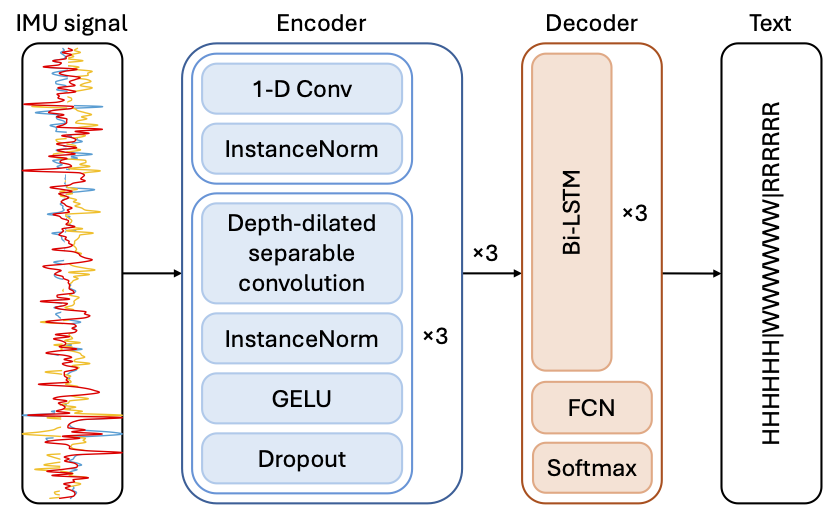

# Robust and Efficient Writer-Independent IMU-Based Handwriting Recognization

This repository is the official implementation of "[Robust and Efficient Writer-Independent IMU-Based Handwriting Recognization](https://arxiv.org/abs/2502.20954)".

## Introduction

The paper introduces a handwriting recognition model for IMU-based data, leveraging a CNN-BiLSTM architecture. The model is designed to enhance recognition accuracy for unseen writers and outperforms all competitors on WI datasets.



### OnHW Word500 Right-Handed Dataset

- Righthanded wi/wd word500

| model                | WD CER | WD WER | WI CER | WI WER | #Params | MACs |
| -------------------- | ------ | ------ | ------ | ------ | ------- | ---- |
| CNN+BiLSTM *(orig.)* | 0.1716 | 0.5195 | 0.2780 | 0.6091 | 0.40M   | 153M |
| CNN+BiLSTM           | 0.1597 | 0.5243 | 0.1716 | 0.4240 | 0.40M   | 153M |
| CLDNN                | 0.1696 | 0.5404 | 0.1715 | 0.3948 | 0.75M   | 291M |
| Transformer          | 0.2615 | 0.6283 | 0.1139 | 0.2573 | 3.96M   | 509M |
| ResNet *(enc.)*      | **0.1294** | **0.4164** | 0.0850 | 0.1846 | 3,97M   | 591M |
| ConvNeXt *(enc.)*    | 0.1515 | 0.4657 | 0.0812 | 0.1791 | 3.86M   | 600M |
| MLP-Mixer *(enc.)*   | 0.1438 | 0.4659 | 0.0964 | 0.2149 | 3.90M   | 802M |
| Transformer *(enc.)* | 0.1817 | 0.5242 | 0.1060 | 0.2303 | 3.71M   | 477M |
| SwinV2 *(enc.)*      | 0.1750 | 0.4983 | 0.0820 | 0.1814 | 3.88M   | 601M |
| Transformer *(dec.)* | 0.1396 | 0.4407 | 0.0864 | 0.1881 | 3.82M   | 590M |
| mLSTM *(dec.)*       | 0.2267 | 0.5749 | 0.0841 | 0.1803 | 4.10M   | 625M |
| Ours                 | 0.1546 | 0.4551 | **0.0746** | **0.1559** | 3.89M   | 600M |

## Installation

Create a new conda virtual environment

```bash
conda create -n rewi python=3.10
conda activate rewi
```

Clone this repo and install required packages

```bash
git clone https://github.com/jindongli24/REWI.git
pip install -r requirements.txt
```

## Dataset

For commercial reasons, our dataset will not be published. Alternatively, you can use the OnHW public dataset for training and evaluation. In the paper, we use the right-handed writer-independent subset of the OnHW-words500 dataset. To download the dataset, please visit: https://www.iis.fraunhofer.de/de/ff/lv/dataanalytics/anwproj/schreibtrainer/onhw-dataset.html

We use a MSCOCO-like structure for the training and evaluation of our dataset. After the OnHW dataset is downloaded, please convert the original dataset to the desired structure with the notebook `onhw.ipynb`. Please adjust the variables `dir_raw`, `dir_out`, and `writer_indep` accordingly.

## Training

In the paper, models are trained in a 5-fold cross validation style, which can be done using the `main.py` to train each fold individually. Please adjust the configurations in the `train.yaml` configuation file accordingly. Additionally, as competitor CLDNN is trained with different strategy, please always use the `*_mohamad.*` files for training and evaluation.

```bash
python main_mukul.py -c configs/train_mukul.yaml
```

Alternatively, you can also train all folds at once sequentially with `train_cv.py`. The script will generate configuration files for all folds in a `temp*` directory and run `main.py` with these configuration files sequentially. After the training is finished, the `temp*` directory will be deleted automatically.

```bash
python train_cv.py -c configs/train_mukul.yaml -m main.py
```

## Evaluation

As we are using cross validation, the results are already given in the output files of training. However, you can always re-evaluate the model with the configuration and weight you want. In the case, please ajust the `test.yaml` file accordingly and run `main.py` with it.

```bash
python main_mukul.py -c configs/test_mukul.yaml
```

After you get all results of all folds, you can summarize the results and also calculate the #Params and MACs with `evaluate.py`.

```bash
python evaluate.py -c configs/test_mukul.yaml
# or
python evaluate.py -c path_to_the_configuration_file_in_the_work_directory
```

## License

This project is released under the MIT license. Please see the `LICENSE` file for more information.

## Citation

If you find this repository helpful, please consider citing:

```
@misc{li2025robustefficientwriterindependentimubased,
      title={Robust and Efficient Writer-Independent IMU-Based Handwriting Recognization}, 
      author={Jindong Li and Tim Hamann and Jens Barth and Peter Kaempf and Dario Zanca and Bjoern Eskofier},
      year={2025},
      eprint={2502.20954},
      archivePrefix={arXiv},
      primaryClass={cs.LG},
      url={https://arxiv.org/abs/2502.20954}, 
}
```
